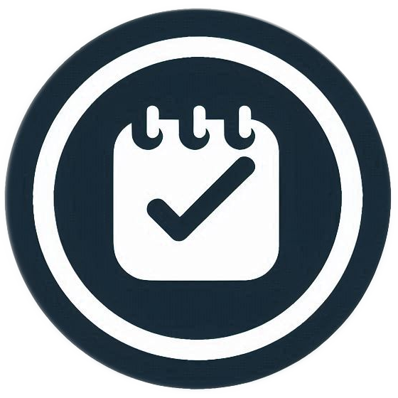

<h3 align="center">Todo App</h3>

  

The Todo App is a minimalist task management solution built with Flutter and Supabase. It helps users track daily tasks with authentication.

<strong>Key Features:</strong>

<ul>
  <li>Task Management: Create, read, update, and delete tasks.</li>
  <li>Authentication: Secure login via Supabase Auth (email/password).</li>
  <li>Responsive UI: Clean and adaptive layout.</li>
  <li>Testing & CI: Full coverage with unit, widget, and integration tests. Automated via GitHub Actions.</li>
</ul>

<h3>Technical Details:</h3>

Built using Flutter and Supabase. Core dependencies include:
<ul>
  <li><code>supabase_flutter</code></li>
  <li><code>flutter_test</code> for test automation</li>
  <li>CI/CD integration with <code>GitHub Actions</code></li>
</ul>

